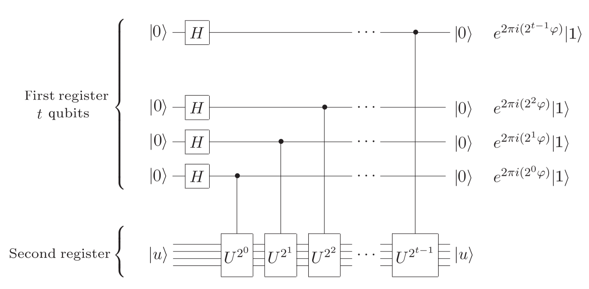
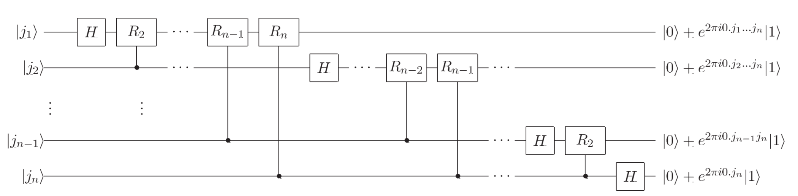
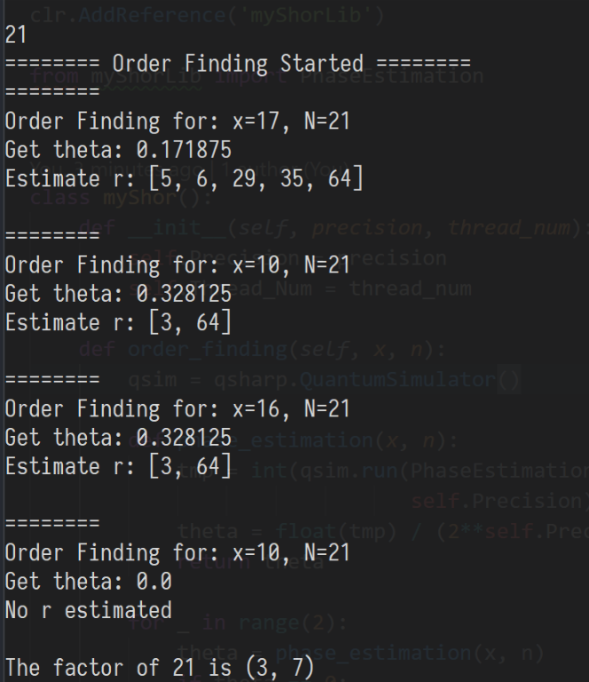

# Course Project - Shor's Algorithm

CS251 Quantum Information Science, 2018 @ ACM Honors Class, SJTU
<script src="https://cdn.mathjax.org/mathjax/latest/MathJax.js?config=TeX-AMS-MML_HTMLorMML" type="text/javascript"></script>
$\newcommand{\ket}[1]{\left|{#1}\right\rangle}
\newcommand{\bra}[1]{\left\langle{#1}\right|}$

## Lecturer

Prof. **Runyao Duan**


## Group Member

- **Zetian Jiang**
- **Zhanghao Wu**
- **Zhou Fan**


## Abstract

We implemented Shor's Algorithm in this project. The quantum part of the algorithm, i.e. the phase estimation subroutine, is implemented in Q# programming language, and we encapsulated this part to provide a flexible callable interface. In this way one can easily call our quantum subroutine in programming languages other than Q# or C#, for instance, Python. With this cross-language feature, we were able to implement the classical part of Shor's algorithm in Python, which is presented later in this Jupyter notebook. In addition, we introduced parallel computation in the implementation of Shors' algorithm, running multiple order finding subroutine simultaneously to accelerate the process. Finally, we wrote a test script to factorize random numbers from 1 to 70, and the implementation passed the test.


## Adavanced Feature

Our implementation of Shor's algorithm has the following two advanced features described in the course task documentation:

- **Cross-language interoperability**: one can call our Q# subroutine in languages other than C#, such as Python
- **Parallel computation**: we introduced parallel computation in the implementation of Shor's algorithm

## Requirement

- conda
- .Net core sdk >= 2.0

## How to run

1. To install the dependencies, run command `conda env create -f ./environment.yml`
2. Activate the python environment, run command `activate qsharp-samples`
3. Run command `cd ./myShorLib/; dotnet build`, which will build the dynamic library of the Q#
4. Run command `cd ../Classical` to go into the classical part of the codes.
5. You can now run `python shor.py` to run the Shor's Algorithm and the program will wait for your input of the integer to be factorized. Or you can run `python test.py` to run the Shor's Algorithm to factorize integers from 1 to 100, and output the result to ./test.out


## Directory Structure 

### Classical Part

[gcd.py](./gcd.py): This code calculate the greatest common divider of two given number a and b


```python
def gcd(a, b):
    if b > a:
        a, b = b, a
    while b > 0:
        a = a % b
        a, b = b, a
    return a
```

[fastPow.py](./Classical/fastPow.py): This code calculate the answer of $a^b\pmod N$


```python
def fastPow(a, b, N):
    ans = 1
    while (b > 0):
        if b % 2:
            ans = ans * a % N
        b = b // 2
        a = a * a
    return ans
```

[miller_robin.py](./Classical/miller_robin): This code test that whether a given number $N$ is a prime number.


```python
def miller_robin(n):
    if n == 2 or n == 3:
        return True
    if n % 2 == 0:
        return False

    t = 10
    q = 0
    m = n - 1
    while m % 2 == 0:
        q += 1
        m /= 2
    for _ in range(t):
        a = random.randint(2, n-2)
        x = fastPow.fastPow(a, m, n)
        if x == 1:
            continue
        j = 0
        while j < q and x != n-1:
            x = (x * x) % n
            j += 1
        if j >= q:
            return False
    return True
```

[power.py](./Classical/power.py): This code test whether a given number $N$ is in the form of $a^b$


```python
def power(N):
    def isPower(l, r, s, N):
        if (l > r):
            return -1
        mid = (l + r) / 2
        ans = fastPow.fastPowBool(mid, s, N)
        if (ans == N):
            return mid
        elif (ans < N):
            return isPower(mid+1, r, s, N)
        else:
            return isPower(l, mid-1, s, N)

    s = int(math.floor(math.log(N, 2))) + 1
    r = int(math.floor(math.sqrt(N))) + 1
    for i in range(2, s):
        ans = isPower(2, r, i, N)
        if ans != -1:
            return ans
    return -1
```

[shor.py](./Classical/shor.py): This code is the exactly we combine the tools together and factorize a given number $N$.
* *shor* is the interface that can be called to find factorization of $N$
* *order_finding* is the function that can be called to find possible order for the given number pair $(x, n)$


```python
class myShor():
    def __init__(self, precision, thread_num):
        self.Precision = precision
        self.Thread_Num = thread_num

    def order_finding(self, x, n):
        qsim = qsharp.QuantumSimulator()

        def phase_estimation(x, n):
            tmp = int(qsim.run(PhaseEstimation, x, n,
                               self.Precision).result().clr_object)
            theta = float(tmp) / (2**self.Precision)
            return theta

        for _ in range(2):
            theta = phase_estimation(x, n)
            if theta == 0:
                print("========\nOrder Finding for: x={}, N={}\nGet theta: {}\nNo r estimated\n".format(
                    x, n, theta))
                continue

            r = fraction.denominator(theta, n)
            print("========\nOrder Finding for: x={}, N={}\nGet theta: {}\nEstimate r: {}\n".format(
                x, n, theta, r))
            for i in r:
                m = fastPow.fastPow(x, i, n)
                if m == 1:
                    return i
        return -1

    def shor(self, n):
        if miller_robin.miller_robin(n):
            return (1, n)
        else:
            tmp = power.power(n)
            if tmp != -1:
                return (tmp, n // tmp)
            else:
                if (n % 2 == 0):
                    return (2, n // 2)
                while True:
                    # Parrel computing for some random x
                    xlist = random.sample(range(3, n - 1), self.Thread_Num)
                    g = [gcd.gcd(x, n) for x in xlist]
                    for idx, g in enumerate(g):
                        if (g != 1):
                            # ======= For debug ===========
                            # while gcd.gcd(xlist[idx], n) != 1:
                            #     newx = random.randint(3, n - 1)
                            #     xlist[idx] = newx
                            # ======= In Real Quantum Computer =========
                            return (g, n // g)

                    print("======== Order Finding Started ========")
                    threadPool = ThreadPool(processes=self.Thread_Num)
                    results = []
                    for x in xlist:
                        results.append(threadPool.apply_async(
                            self.order_finding, args=(x, n)))
                    threadPool.close()
                    threadPool.join()
                    results = [r.get() for r in results]

                    for r in results:
                        if r == -1:
                            continue
                        if (r % 2 == 0):
                            s = fastPow.fastPow(x, r // 2, n)
                            if (s != 1 and s != n-1):
                                g1 = gcd.gcd(s+1, n)
                                g2 = gcd.gcd(s-1, n)
                                if (g1 != 1):
                                    return (g1, n // g1)
                                elif (g2 != 1):
                                    return (g2, n // g2)
```

[fraction.py](./Classical/fraction.py): This code estimate the denominator of possible fraction representing the given decimal $x$. The fra


```python
def denominator(x, N):
    seq = []
    if (x < 1):
        x = 1 / x
    k = 10
    for i in range(10):
        seq.append(math.floor(x))
        if (abs(x - math.floor(x)) < 1e-9):
            k = i + 1
            break
        x = 1 / (x - math.floor(x))
    ans = []
    ans2 = []
    for i in range(k):
        up = 1
        down = seq[i]
        for j in range(i):
            t = seq[i-1-j]
            d = down
            down = down * t + up
            up = d
        ans.append(int(down))
        ans2.append(int(up))
    return ans

```

[test.py](./Classical/test.py): This code test our implementaion of shor's algorithm for numbers from 1 to 100. And our implementation handles the task very well.


```python
alg = myShor(6, 3)
with open('test.out', 'w', encoding='utf8') as outfile:
    for i in range(1, 100):
        print(alg.shor(i), file=outfile)
        outfile.flush()
```

### Quantum Part
[Operation.qs](./myShorLib/Operation.qs): This implement the quantum part of the algorithm
* *PhaseEstimation* is the interface for quantum phase estimation.


```python
operation PhaseEstimation(
    x : Int, 
    N : Int, 
    precision : Int) : Int
{
    body
    {
        let eigenLength = BitSize(N);
        mutable res = 0;

        using (eigenvector = Qubit[eigenLength]){
            X(eigenvector[0]);

            using (target = Qubit[precision]){

                PhaseEstimationImpl(x, N, target, eigenvector);

                for (i in 0..(precision - 1)) {
                    set res = res * 2;
                    if (M(target[i]) == One) {
                        set res = res + 1;
                    }
                }
                ResetAll(target);
                ResetAll(eigenvector);
            }
        }

        return res;
    }
}
```

* *PhaseEstimationImpl* implements the details for phase estimation. 


```python
operation PhaseEstimationImpl (
    x : Int,
    N : Int,
    target : Qubit[],
    eigenvector : Qubit[]) : ()
{
    body {
        let targetLength = Length(target);

        for (idx in 0..(targetLength - 1)) {
            H(target[idx]);
        }

        mutable power = 1;
        for (idx in 0..(targetLength - 1)) {
            (Controlled ConstructU) ([target[targetLength - 1 -idx]], (x, N, power, eigenvector)); 
            set power = power * 2;
        }

        (InverseFT)(target);
        // (Adjoint QFT)(BigEndian(target));
    }
}
```

* $U$ is constructed by the code below:


```python
operation ConstructU(
    x : Int,
    modulus : Int, 
    power : Int, 
    target : Qubit[]) : ()
{
    body {
        ModularMultiplyByConstantLE(
            PowerMod(x, power, modulus), 
            modulus,
            LittleEndian(target)
        ); 
    }
    adjoint auto

    controlled auto
    adjoint controlled auto 
}
```

* *Inverse fourier transformation* is implemented as below:


```python
operation InverseFT(qs : Qubit[]) : () 
{
    body {
        let qLength = Length(qs);
        for (i in 0..(qLength - 1)) {
            for (j in 0..(i-1)) {
                (Controlled R1Frac) ([qs[j]], (1, i - j, qs[i]));
            }
            H(qs[i]);
        }

        for (i in 0..qLength/2-1) {
            SWAP(qs[i],qs[qLength-1-i]);
        }

    }
    adjoint auto
    controlled auto
    controlled adjoint auto
}
```


## Process of Shor's Algorithm

The input is a number $N$ to be factorized.
1. Check if $N$ is a prime number, this can be done with some classical algorithm such as [Miller-Robin](./Classical/miller-robin.py) primality test. If $N$ is prime number, the factorization is no longer needed.
2. Check if $N$ is a power of a prime number, that is, if there exists a prime number $a$ such that $N = a^k$. If so, then $a$ is a factor of $N$, then we have the factorization of $N$. And the checking process can be found in [power](./Classical/power.py)
3. Now the number $N$ can be represented as $$N = p_1^{k_1} p_2^{k_2} ... p_n^{k_n}.$$ Perform the following operations until we find a factorization of $N$:
   1. Generate a random number $x < N$.
   2. Check if $x$ is coprime to $N$, using the [gcd](./Classical/gcd.py), if not, then the greatest common divisor of $x$ and $N$ is a factor of $N$. Then we have a factorization of $N$.
   3. Now we know that $x$ and $N$ are coprime to each other. There exists an order $r$ of $x$ such that $$x^r \equiv 1 \pmod N.$$ To get the order $r$, the [quantum phase estimation](./myShorLib/Operation.qs) comes in, the details of which will be discussed in next part of this report.
   4. The quantum phase estimation returns a number $\theta = \frac{s}{r}$ in decimal with certain precision. Then a [continued fraction decomposition](./Classical/fraction.py) is needed to estimate the exact value of $r$. 
   5. The steps to estimate $r$ from $\theta$ are as follows. Present $\theta$ as $$\frac{1}{a_0 + \frac{1}{a_1 + \dots \frac{1}{a_n + b}}}.$$ Regardless of b, we use $$\frac{1}{a_0 + \frac{1}{a_1 + \dots \frac{1}{a_n}}} = \frac{c_n}{d_n}$$ as its estimation. Check each $d_n \leq N$ whether $d_n$ is the order of x.
   6. Unfortunately, because of the limited precision of the phase returned by the quantum algorithm, the randomness of the program and the limitation of the continued fraction decomposition for reducible fractions, we may not get a proper $r$. 
   7. If the order $r$ is odd, try to run the phase estimation again or try another $x$. Else we have $$(x^{\frac{r}{2}} + 1)(x^{\frac{r}{2}} - 1) = x^r - 1 \equiv 0 \pmod N.$$ If $x^{\frac{r}{2}} + 1 \pmod N$ and $x^{\frac{r}{2}} - 1 \pmod N$ are both not zero, then we have a factorization of $N$. If not, try to run the phase estimation again or try another $x$. And here is the exact place where parallel computing plays a role.

## Quantum Phase Estimation

1. Input two register. The first one contains $t$ qubits in state $\left|{0}\right\rangle$,where $t$ is the precision of the estimation. The second one is eigenvector of U (actually it can be any vector that is in the space spanned by the eignevectors of U, and in the code it is an initialized vector with $\left|{1}\right\rangle$ at the first and $\left|{0}\right\rangle$ at other position). Apply the circuit shown in Figure 1 to get each bit of $\phi$.
2.  The circuit begins by applying a Hadamard transform to the first register, followed by application of controlled-U operations on the second register, with U raised to successive powers of two. 

*Figure 1: The first stage of the phase estimation procedure*
3. Apply inverse Fourier transform circuit on first register while doing nothing on second one. The Fourier transform circuit is shown in Figure 2 and the normalization factors and swap gates which should be applied at the circuit are not shown. 
The circuit begins by applying a Hadamard transform , followed by application of controlled-$R_i$ operations where operation $R_k$'s matrix representation is $\begin{pmatrix}1 & 0 \\0 & e^{2 \pi i / 2^k}\end{pmatrix}$. Finally it ends with a swap gate to swap $\left|{\phi_i}\right\rangle$ and $\left|{\phi_{n-i+1}}\right\rangle$.
    
*Figure 2: Quantum Fourier Transform circuit*
4. The final state of first register is $\left|{\theta}\right\rangle$ where $\theta$ is a t bit estimation of a element in $\{\frac{s}{r} | $r is the order$, s=0 \dots r-1\}$. Measure the first register and get a decimal $\theta$.

## Cross-language Interoperability

To encapsulate the quantum subroutine implemented in Q#, we separate the Q# operations as a standalone .NET standard library project. And we compiled this project to generate the library assemblies. Then one can use operations in that library in languages other than C# by adding a reference to the assemblies file. For instance, to use our Q# library in Python, one could use the Python.NET package to load the assemblies, and one should also add references to the assemblies from the Q# development kit released by Microsoft as dependencies.

The following example shows how to load our assemblies in Python. One should first have Python.NET package installed in Python environment in order to use the clr module. One can use the command `pip install pythonnet` to install Python.NET package. It is also needed to add the path to the assemblies file in the system path such that the `clr` module could find the assemblies. Another requirement is Python library `qsharp`, which provides a QuantumSimulator class which wraps the Microsoft.Quantum.Simulation.Simulators.QuantumSimulator .NET class provided with the Quantum Development Kit. This wrapper provides a few useful convienence features that we will use later.


```python
import sys
sys.path.append('./myShorLib/bin/Release/netstandard2.0')
```


```python
import qsharp
```


```python
import clr
clr.AddReference("Microsoft.Quantum.Canon")
clr.AddReference('myShorLib')
```

Here `myShorLib` is the quantum library we implemented in Q#. Having added reference to the assemblies, we can now use operations in the library. To call the operation, we could just import it just as a normal Python package.

## Parallel computation

In Shor's algorithm, we use the quantum phase estimation subroutine to find the order $r$ of a random number $x < N$, i.e. a positive number $r$ such that
$$x^r \equiv 1 \pmod N$$
We introduced parallel computation in this process, that is, performing the order finding subroutine for multiple random numbers simultaneously with multi-threading technique. This could accelerate the process of Shor's algorithm when $N$ is large. With the help of the cross-language interoperability of our implementation of the phase estimation subroutine, we can easily implement the parallel part in Python.


```python
threadPool = ThreadPool(processes=self.Thread_Num)
results = []
for x in xlist:
    results.append(threadPool.apply_async(
        self.order_finding, args=(x, n)))
threadPool.close()
threadPool.join()
results = [r.get() for r in results]
```

For example, when we calls the code to factorize 21. The code will calculate several $x$ at the same time, and get the result in a short time. The process is shown in the figure below.

